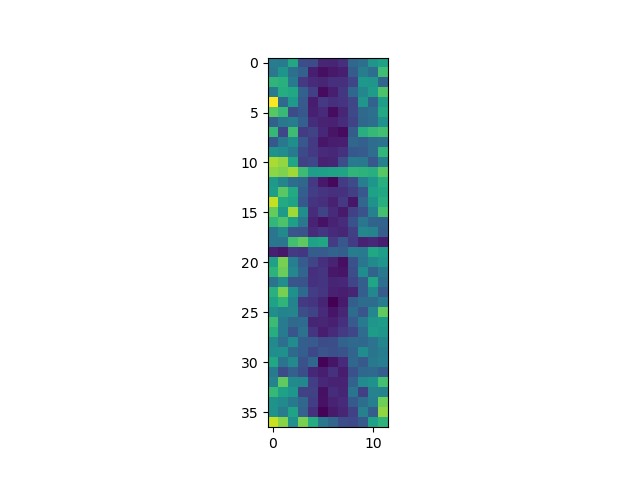
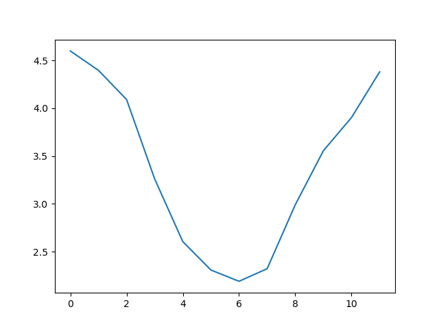
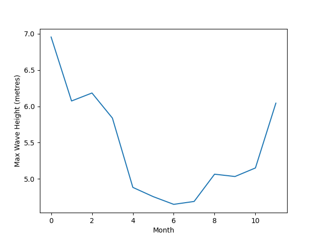

::::::::::::::::::::::::::::::::::::::::::  questions

- "How can I visualize tabular data in Python?"
- "How can I group several plots together?"

::::::::::::::::::::::::::::::::::::::::::::::::::


::::::::::::::::::::::::::::::::::::::::::::  objectives

- "Plot simple graphs from data."
- "Plot multiple graphs in a single figure."

::::::::::::::::::::::::::::::::::::::::::::::::::

## Visualizing data
The mathematician Richard Hamming once said, "The purpose of computing is insight, not numbers,"
and the best way to develop insight is often to visualize data.  Visualization deserves an entire
lecture of its own, but we can explore a few features of Python's `matplotlib` library here.  While
there is no official plotting library, `matplotlib` is the _de facto_ standard.  First, we will
import the `pyplot` module from `matplotlib` and use two of its functions to create and display a
[heat map](learners/reference.md#heat-map) of our data:


::::::::::::::::::::::::::::::::::::::::::  prereq
## Episode Prerequisites

If you are continuing in the same notebook from the previous episode, you already
have a `reshaped_data` variable and have imported `numpy`.

For ease, let's rename the variable:
```python
data = reshaped_data
```

If you are starting a new notebook at this point, you need the following three lines:
```python
import numpy
data = numpy.loadtxt(fname='wavesmonthly.csv', delimiter=',', skiprows=1)
data = numpy.reshape(data[:,2], [37,12])
```

...or, if you saved the reshaped data into a file

```python
import numpy
data = numpy.loadtxt(fname='reshaped_data.csv', delimiter=',')
```

::::::::::::::::::::::::::::::::::::::::::::::::::


Now let's use the Matplotlib library to plot this data. We'll need to import from the `matplotlib.pyplot` library. We can then use the `imshow` function to plot this data.
In some versions of Python we'll need to call the `show` function to display the graph. This will plot a heatmap of our data.

```python
import matplotlib.pyplot
image = matplotlib.pyplot.imshow(data)
matplotlib.pyplot.show()
```


{alt="Heat map representing the wave height from the first 50 days. Each cell is colored by value along a color gradient from blue to yellow."}

Each row in the heat map corresponds to a year in the dataset, and each column corresponds to a month.  Blue pixels in this heat map represent low values, while
yellow pixels represent high values. We can see low blue values in the middle (summer) months, and higher waves at the start and end of the year. This demonstrates that there is a seasonal cycle present. With calm summers bringing lower waves, and windy winters generating big waves. There are still differences year to year, with some stormier summers and calmer winters.

Now let's take a look at the average wave-height per month over time. Here we'll used the `plot` function to plot a line graph.

```python
ave_waveheight = numpy.mean(data, axis=0)
ave_plot = matplotlib.pyplot.plot(ave_waveheight)
matplotlib.pyplot.show()
```


{alt="A line graph showing the monthly average wave height over a 37 year period."}

This is a good way to smooth out variability, and see what is called a 'climatology', representing the long-term wave climate over several years or decades.

Here, we have put the average wave heights per month across all years in the array
`ave_waveheight`, then asked `matplotlib.pyplot` to create and display a line graph of those
values.  The result is a smooth seasonal cycle, with a maximum in month 0 (January) and minimum in month 6 (July).
But a good data scientist doesn't just consider the average of a dataset, so let's have a look at the minimum and maximum too. It's good practice to add
axes labels to our graphs, these can be done with the `xlabel` and `ylabel` functions in `matplolib.pyplot`.

```python
matplotlib.pyplot.ylabel("Max Wave Height (metres)")
matplotlib.pyplot.xlabel("Month")
max_plot = matplotlib.pyplot.plot(numpy.max(data, axis=0))
matplotlib.pyplot.show()
```


{alt="A line graph showing the maximum wave height per month over a 37 year period."}

```python
matplotlib.pyplot.ylabel("Min Wave Height (metres)")
matplotlib.pyplot.xlabel("Month")
min_plot = matplotlib.pyplot.plot(numpy.min(data, axis=0))
matplotlib.pyplot.show()
```


{alt="A line graph showing the minimum wave height per month over a 37 year period."}

The minimum and maximum graphs show the large spread of all possible wave heights throughout the dataset. There is still a seasonal cycle, but less clear as the extremes are much less smooth. The maximum wave heights can reach a massive 7 metres, and even in the summer the maximum is 4.5m (around the height of a double decker bus!) The minimum values are more similar throughout the year, varying between 1.5 and 2.5 metres.

Plotting the data in this way, allows us to get a broad picture of the wave climate, without having to examine
the numbers themselves without visualization tools.

### Grouping plots
You can group similar plots in a single figure using subplots.
This script below uses a number of new commands. The function `matplotlib.pyplot.figure()`
creates a space into which we will place all of our plots. The parameter `figsize`
tells Python how big to make this space. Each subplot is placed into the figure using
its `add_subplot` [method](learners/reference.md#method). The `add_subplot` method takes
3 parameters. The first denotes how many total rows of subplots there are, the second parameter
refers to the total number of subplot columns, and the final parameter denotes which subplot
your variable is referencing (left-to-right, top-to-bottom). Each subplot is stored in a
different variable (`axes1`, `axes2`, `axes3`). Once a subplot is created, the axes can
be titled using the `set_xlabel()` command (or `set_ylabel()`), note these are different to the `xlabel` and `ylabel` functions used by `matplot.pyplot`.
Let's create three new plots, side by side, this time showing within each of the 37 years of the dataset - notice how we now use `axis=1` in our calls to the summary statistic functions:

```python
fig = matplotlib.pyplot.figure(figsize=(10.0, 3.0))

axes1 = fig.add_subplot(1, 3, 1)
axes2 = fig.add_subplot(1, 3, 2)
axes3 = fig.add_subplot(1, 3, 3)

axes1.set_ylabel('Average')
axes1.set_xlabel('Year index')
axes1.plot(numpy.mean(data, axis=1))

axes2.set_ylabel('Max')
axes2.set_xlabel('Year index')
axes2.plot(numpy.max(data, axis=1))

axes3.set_ylabel('Min')
axes3.set_xlabel('Year index')
axes3.plot(numpy.min(data, axis=1))

fig.tight_layout()

matplotlib.pyplot.savefig('wavedata.png')
matplotlib.pyplot.show()
```


{alt="Three line graphs showing the daily average, maximum and minimum wave-heights over a 446-day period."}

This script tells the plotting library
how large we want the figure to be,
that we're creating three subplots,
what to draw for each one,
and that we want a tight layout.
(If we leave out that call to `fig.tight_layout()`,
the graphs will actually be squeezed together more closely.)

The call to `savefig` stores the plot as a graphics file. This can be
a convenient way to store your plots for use in other documents, web
pages etc. The graphics format is automatically determined by
Matplotlib from the file name ending we specify; here PNG from
'wavedata.png'. Matplotlib supports many different graphics
formats, including SVG, PDF, and JPEG.

::::::::::::::::::::::::::::::::::::::::::  callout

## Importing libraries with shortcuts

So far we use have used the code `import matplotlib.pyplot`
[syntax](learners/reference.md#syntax)
to import the `pyplot` module of `matplotlib`. An alternative method for importing is to use
`import matplotlib.pyplot as plt`.
Importing `pyplot` this way means that after the initial import, rather than writing
`matplotlib.pyplot.plot(...)`, you can now write `plt.plot(...)`.
Another common convention is to use the shortcut `import numpy as np` when importing the
NumPy library. We then can write `np.loadtxt(...)` instead of `numpy.loadtxt(...)`,
for example.

Some people prefer these shortcuts as it is quicker to type and results in shorter
lines of code - especially for libraries with long names! You will frequently see
Python code online using a `pyplot` function with `plt`, or a NumPy function with
`np`, and it's because they've used this shortcut. It makes no difference which
approach you choose to take, but you must be consistent as if you use
`import matplotlib.pyplot as plt` then `matplotlib.pyplot.plot(...)` will not work, and
you must use `plt.plot(...)` instead. Because of this, when working with other people it
is important you agree on how libraries are imported. From this point onwards this lesson uses
`plt` to mean `matplotlib.pyplot`.

::::::::::::::::::::::::::::::::::::::::::::::::::

:::::::::::::::::::::::::::::::::::::::  challenge

## Plot Scaling

Why do all of our plots stop just short of the upper end of our graph?

:::::::::::::::  solution
Because matplotlib normally sets x and y axes limits to the min and max of our data
(depending on data range)
:::::::::::::::::::::::::

If we want to change this, we can use the `set_ylim(min, max)` method of each 'axes',
for example:

```python
axes3.set_ylim(0,8)
```


Update your plotting code to automatically set a more appropriate scale.
(Hint: you can make use of the `max` and `min` methods to help.)

:::::::::::::::  solution
```python
# One method
axes3.set_ylabel('min')
axes3.plot(numpy.min(data, axis=1))
axes3.set_ylim(0,8)
```

:::::::::::::::::::::::::

:::::::::::::::  solution
```python
# A more automated approach
min_data = numpy.min(data, axis=1)
axes3.set_ylabel('min')
axes3.plot(min_data)
axes3.set_ylim(numpy.nanmin(min_data), numpy.nanmax(min_data) * 1.1)
```

:::::::::::::::::::::::::
::::::::::::::::::::::::::::::::::::::::::::::::::

:::::::::::::::::::::::::::::::::::::::  challenge

## Plotting multiple graphs on one pair of axes

We can also plot more than one dataset on a single pair of axes, and Matplotlib gives us lots of control over
the output. Can you plot the maximum, minimum, and mean all on the same axes, change the colour and marker used for each of the plots,
and give the plot a legend?

:::::::::::::::  solution
We can call `plot` multiple times before we call `show`, and each of those will be added to the axes. We can also
specify format options as a string (this needs to specified straight after the data to plot), with all available options
listed in [the documentation](https://matplotlib.org/stable/api/_as_gen/matplotlib.pyplot.plot.html). We also need to specify the
`label` for each plot, and call `legend()` to make the legend visible.

An example would be

```python
import matplotlib.pyplot as plt
plt.plot(numpy.max(data, axis=0), "bo", label='Maximum')
plt.plot(numpy.average(data, axis=0), "m+", label='Average')
plt.plot(numpy.min(data, axis=0), "r--", label='Minumum')
plt.legend(loc='best')

plt.show()
```

{alt="Three plots showing the average, maximum
 and minimum waveheights plotted on a single pair of axes."}

:::::::::::::::::::::::::
::::::::::::::::::::::::::::::::::::::::::::::::::

:::::::::::::::::::::::::::::::::::::::  challenge

## Make Your Own Plot

Create a plot showing the standard deviation (`numpy.std`)
of the wave data across all months.

:::::::::::::::  solution
```python
std_plot = plt.plot(numpy.std(data, axis=0))
plt.show()
```

:::::::::::::::::::::::::
::::::::::::::::::::::::::::::::::::::::::::::::::

:::::::::::::::::::::::::::::::::::::::  challenge

## Moving Plots Around

Modify the program to display the three plots on top of one another
instead of side by side.

:::::::::::::::  solution
```python
# change figsize (swap width and height)
fig = plt.figure(figsize=(3.0, 10.0))

# change add_subplot (swap first two parameters)
axes1 = fig.add_subplot(3, 1, 1)
axes2 = fig.add_subplot(3, 1, 2)
axes3 = fig.add_subplot(3, 1, 3)

axes1.set_ylabel('average')
axes1.plot(numpy.mean(data, axis=1))

axes2.set_ylabel('max')
axes2.plot(numpy.max(data, axis=1))

axes3.set_ylabel('min')
axes3.plot(numpy.min(data, axis=1))

fig.tight_layout()

plt.show()
```

:::::::::::::::::::::::::

::::::::::::::::::::::::::::::::::::::::::::::::::


::::::::::::::::::::::::::::::::::::::::::::::  keypoints

- "Use the `pyplot` module from the `matplotlib` library for creating simple visualizations."

::::::::::::::::::::::::::::::::::::::::::::::::::
